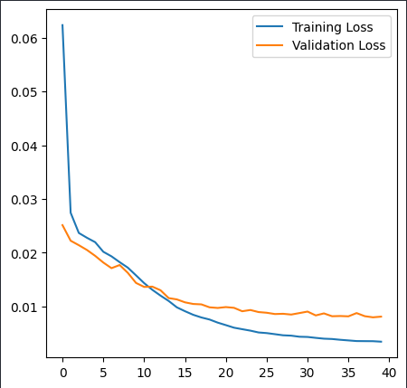
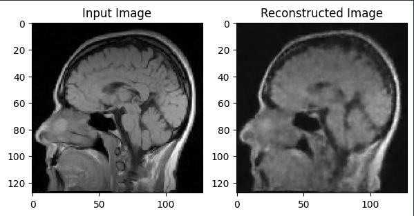
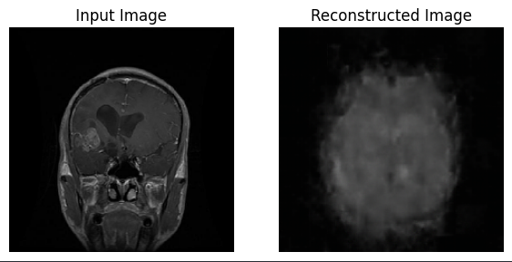
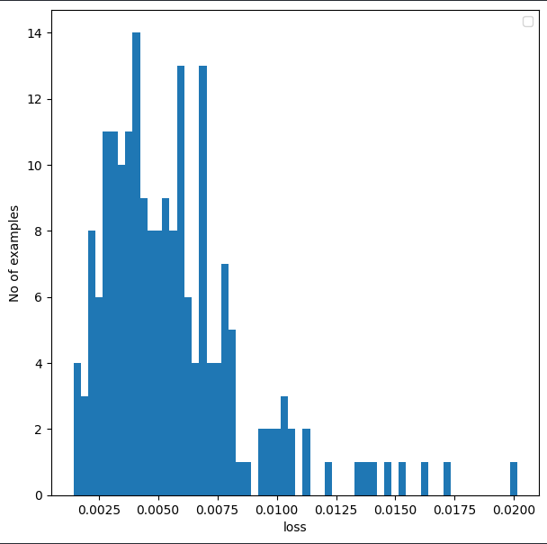
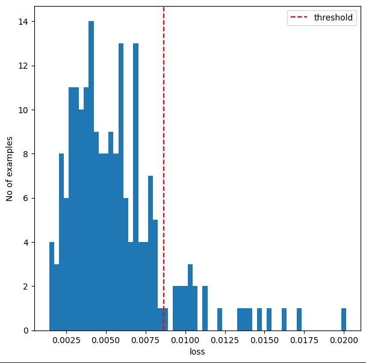
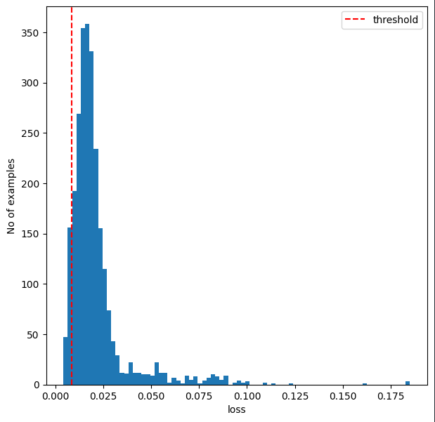
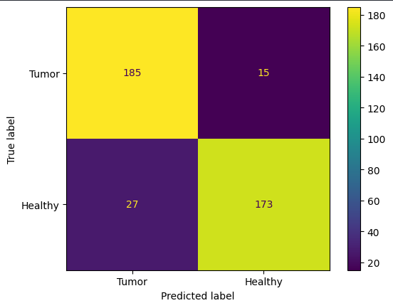

# Brain CT Anomaly Detection with Convolutional Autoencoders

This project implements a convolutional autoencoder in TensorFlow/Keras that can detect anomalies such as tumors in brain CT images.

## Dataset

The dataset includes:
- Healthy brain CT scans
- Tumorous brain CT scans
- Healthy brain MRI scans
- Tumorous brain MRI scans

My model was trained and tested on healthy and tumorous brain CT scan images.

Link to dataset:
- [Kaggle] https://www.kaggle.com/datasets/murtozalikhon/brain-tumor-multimodal-image-ct-and-mri

## Dataset Split
I divided up the dataset into the following splits:
- Normal train data: 1600 images
- Normal valid data: 200 images
- Normal test data: 200 images
- Validation Data: 400 images (normal valid data + 200 tumor images)
- Test Data: 400 images (200 normal images + 200 tumor images)
- Tumor Test Data: 2600 images

## Training
The model was trained exclusively on normal brain CT images. This allowed the model to be able to reconstruct normal brain CT images with a low reconstruction error.

## Inference
The model was able to reconstruct normal images, but with noise. This means that reconstruction loss was low.

The model wasn't able to reconstruct tumor images and capture details. This means that reconstruction loss was very high.

### Establishing a threshold

Normal validation data was passed into the trained autoencoder model. 

The following formula was used to generate the threshold-value: `threshold = np.mean(total_normal_loss) + np.std(total_normal_loss)`

The following distribution was generated after passing in normal test data into the model:

Reconstruction error that is to the left of the threshold are labeled as normal images. The model was able to label a majority of the normal testing images as normal.

### Inference on tumor images

When passing in tumor images, reconstruction loss was a lot higher than the threshold-value; These were labeled as anomalies:

Recontruction error to the right of the threshold are labeled as anomalous.

### Inference on tumor + healthy image dataset

Given the results of how it performed separately on exclusively tumor or healthy images, I wanted to evaluate how the model would do if I gave it a test dataset filled with 50% normal and 50% tumor images. The model was able to achieve 80-90% accuracy in being able to distinguish between tumor and healthy images based on reconstruction loss and threshold.

## Future Improvements for Accuracy
- Using a VAE (Variational Autoencoder) instead of a traditional autoencoder
- Utilizing pre-trained models for the encoder
- Introducing layers such as BatchNormalization
- Adding more convolutional layers

## Future Features
- Making a classifier to classify different types of brain tumors if image is marked as an anomaly
- Incorporating image segmentation for tumors in an image
