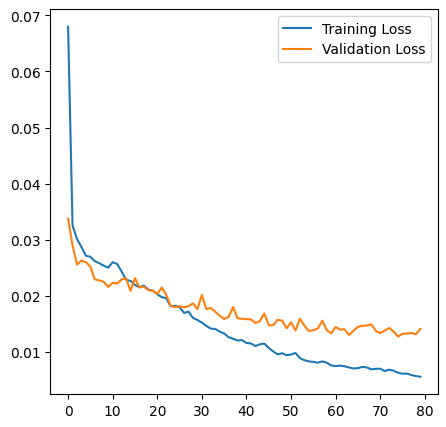
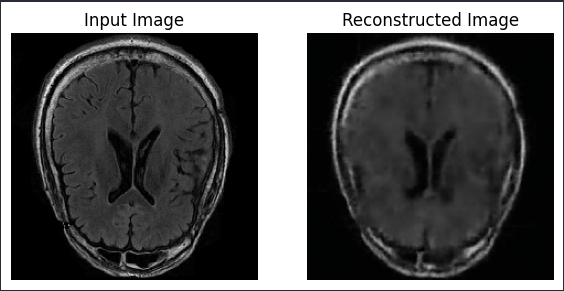
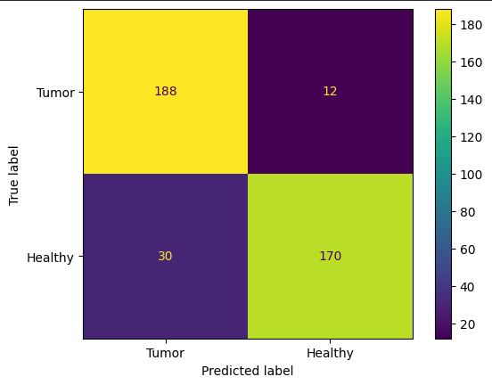

# Unsupervised Brain MRI Anomaly Detection with Convolutional Autoencoders

This project implements a convolutional autoencoder in TensorFlow/Keras that can detect anomalies such as tumors in brain MRI images. The encoder uses a pretrained ResNet50 model to perform feature extraction.

## Overview of Autoencoders
Autoencoders can learn the latent features of an image through its encoder stage and use those latent features to reconstruct the same image in the decoder stage. Comparing the reconstructed image with the original image is what gives us the reconstruction loss.

## Goal
The goal of this project is to be able to identify images as anomalies based on a threshold found from the reconstruction loss distribution. This is an unsupervised learning task, meaning that the model was not given any labels during training. In order for the model to be able to distinguish between both types of images, normal images should have a low reconstruction error that is below the threshold while tumorous images should have a high reconstruction error that is above the threshold. A pretrained ResNet50 model was used for the encoder to capture more latent features.

## Dataset

The dataset includes:
- Healthy brain CT scans
- Tumorous brain CT scans
- Healthy brain MRI scans
- Tumorous brain MRI scans

My model was trained and tested on healthy and tumorous brain MRI scan images.

Link to dataset:
- [Kaggle] https://www.kaggle.com/datasets/murtozalikhon/brain-tumor-multimodal-image-ct-and-mri

## Dataset Split
I divided up the dataset into the following splits:
- Normal train data: 1400 images
- Validation Data: 400 images (200 normal images + 200 tumor images)
- Test Data: 400 images (200 normal images + 200 tumor images)
- Tumor Test Data: 2600 images
- Normal data for thresholding: 200 images

## Training
The model was trained exclusively on normal brain MRI train images. This allowed the model to be able to reconstruct normal brain MRI images with a low reconstruction error. I also used a validation set mixed with normal and tumor images to ensure that my model is able to differeniate between the two. Because ResNet50 is a bigger model with over 20M parameters, I trained the model for around 80 epochs.

## Inference
The model was able to reconstruct normal images, but with noise. It captured some of the important details or outlines. This means that reconstruction loss was low. 

The model wasn't able to reconstruct tumor images and capture details. This means that reconstruction loss was very high.

### Establishing a threshold

I wanted to establish the threshold based on normal data that was unseen by the model during training. This would show how well the model was able to generalize on unseen images.

The following formula was used to generate the threshold-value: `threshold = np.mean(total_normal_loss) + np.std(total_normal_loss)`

The following distribution was generated after passing in normal test data into the model:

The model was able to label a majority of the normal testing images as normal.

### Inference on tumor images

The model was able to label a majority of the tumor testing images as tumors.

### Inference on tumor + healthy image dataset

I wanted to evaluate how the model would do if I gave it a test dataset filled with 50% normal and 50% tumor images. The model was able to achieve above 90% accuracy with the pretrained model in being able to distinguish between tumor and healthy images

## Future Improvements for Accuracy
- Using a VAE (Variational Autoencoder) instead of a traditional autoencoder
- Introducing layers such as BatchNormalization
- Adding more convolutional layers
